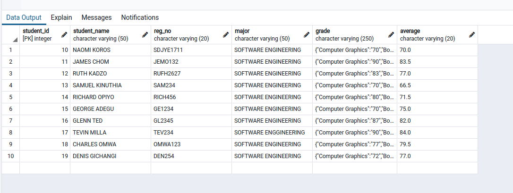
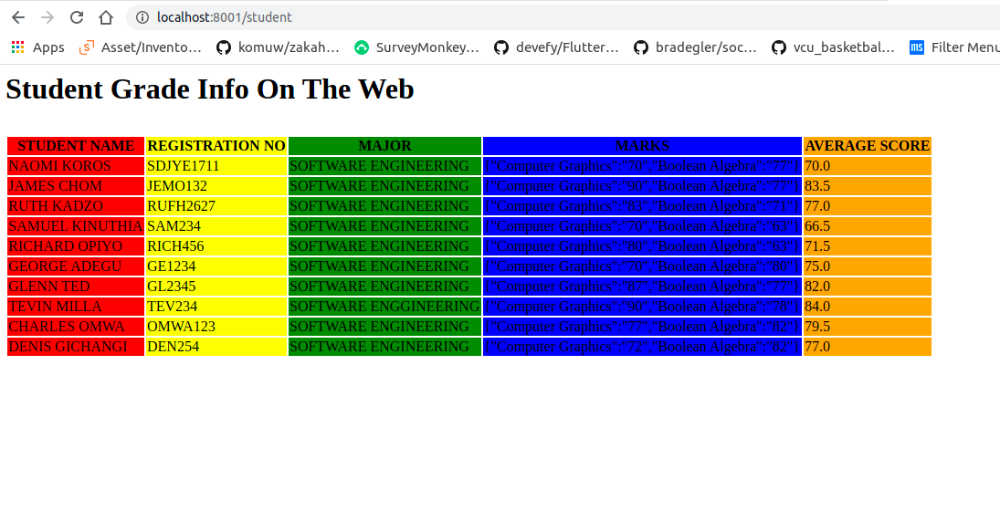

# student_websocket
A java program to to display postgresql table on a browser servlet.

This is the data on my postgresql database

This is the data being displayed on the web from the postgresql table.

